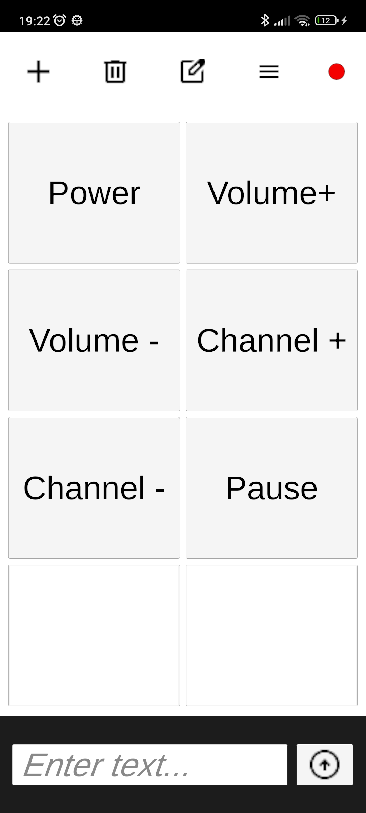
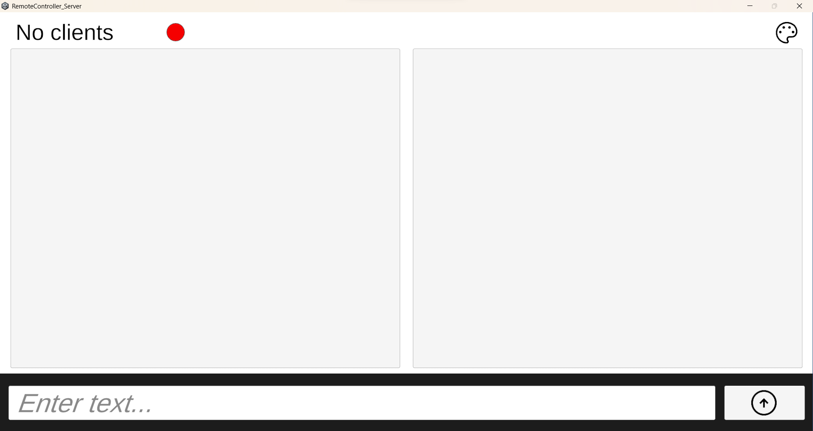
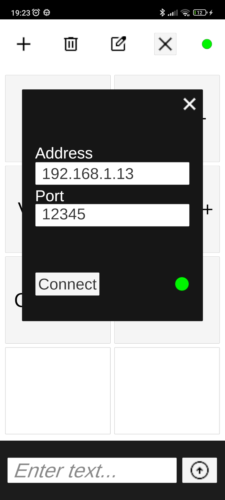
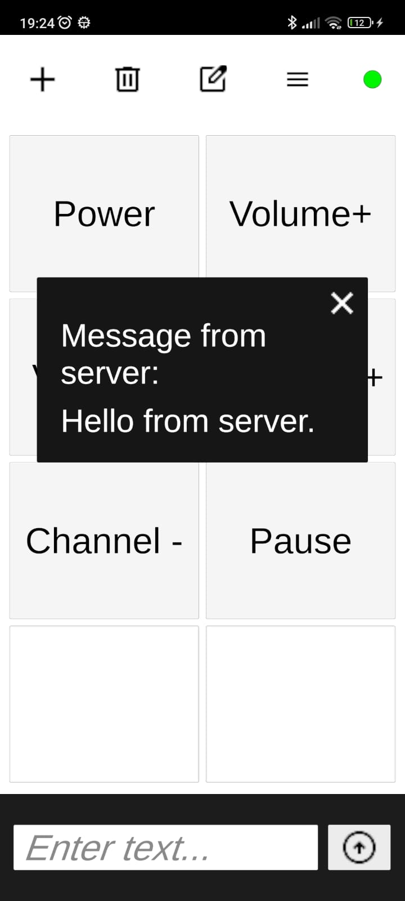
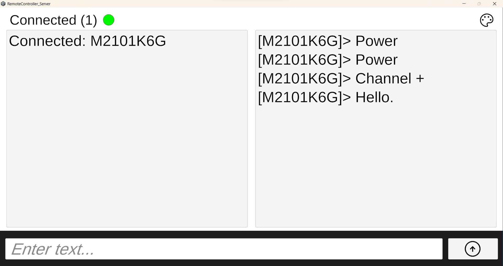
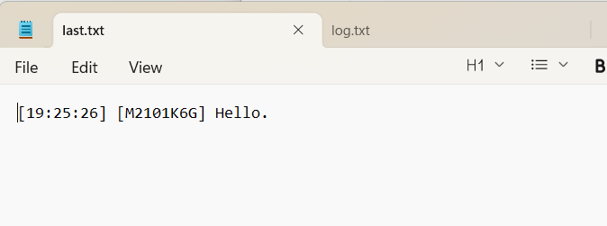
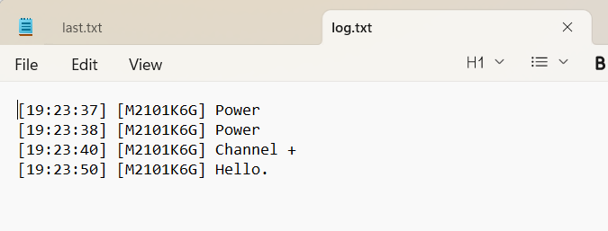

# RemoteController
A client-server system developed in Unity, featuring real-time communication between client and server using socket programming for data exchange.

## Features
- Remote control of a Windows application from an Android device
- Real-time client-server communication using socket (TCP) programming
- Connection management using IP address and port configuration
- Sending control commands from client to server
- Receiving and processing commands on the server
- Connection status monitoring
- User-friendly interfaces for both client and server applications
- Synchronous communication model
- Customizable user interface

## Technologies Used
- Unity Engine (Client & Server applications)
- C# (scripting and networking logic)
- TCP Sockets (network communication)
- Android Build Support (Unity Client)
- Windows Standalone Build (Unity Server)
- .NET networking libraries

## How It Works
- The system consists of two separate Unity applications: a client (Android) and a server (Windows PC).
- The server application is started first and listens for incoming TCP socket connections on a specific IP address and port.
- The client application runs on an Android device and connects to the server using its IP address and port number.
- Once the connection is established, a persistent socket connection is maintained between client and server.
- The system uses synchronous socket programming, meaning that sending and receiving operations are blocking and executed in a sequential manner.
- The client sends control commands (messages) through the socket connection in real time.
- The server receives the messages, parses them, and executes the corresponding actions inside the Unity application.
- The server can also send responses back to the client to confirm received commands or update the connection status.
- Communication continues bi-directionally until the client disconnects or the server stops listening.

## Installation Requirements
- Unity (LTS version recommended)
- Android Build Support (Unity Module)
  - Android SDK & NDK Tools
  - OpenJDK
- .NET (included with Unity)
- Windows PC for server build
- Android device for client application

## How To Run The Application
**1. Clone the repository to your local machine:**
```bash
git clone <repository-url>
```

**2. Run the RemoteController_Server application (Windows PC):**
- Launch Unity Hub
- Click **Open Project**
- Select the `RemoteController_Server` folder
- Open the server scene
- Ensure the server is configured with the correct IP address and port
- Either:
  - Press **Play** to run the server in the Unity Editor, or
  - Build the project as a **Windows Standalone (.exe)** via **Build Settings** and run the executable
  
**3. Run the RemoteController_Client application (Android):**
- Launch Unity Hub
- Click **Open Project**
- Select the `RemoteController_Client` folder
- Switch the platform to **Android** in **Build Settings**
- Build the APK and install it on your Android device
- Launch the application on the device
  
**4. Ensure both devices are connected to the same network (Wi-Fi or LAN), or configure port forwarding if running on different networks.**
  
**5. Start the server first, then launch the client application.**

**6. In the client app, enter the server’s IP address and port number and establish the connection.**

**7. Once connected, you can start sending control commands from the Android client to the Windows server in real time.**

## Screenshots
### Initial UI (Client + Server)
This screenshot shows the user interface when the application is first launched, before any messages are sent.

- Empty chat window
- Input field ready for typing
- Initial connection state
- Client:


- Server:



### Connection Process
This screenshot shows the application menu that allows the client to connect to the server.

- Ip address input
- Port input
- Connect button
- Connection status indicator


### Message Exchange
This screenshot shows the exchanged messages on both the client and server sides of the application.

- Client:


- Server:


### Log Files
This screenshot shows the log files stored on the server side.

- last.txt (last sent message):


- log.txt (whole communication):


- Path to log files (Windows): C:\Users\[YOUR_USERNAME]\AppData\LocalLow\DefaultCompany\RemoteController_Server

## Project Information
- Developed: 2026
- Type: Academic Project
- Platforms: Android (Client), Windows (Server)

## Author
- gmail: andjeladjo@gmail.com
